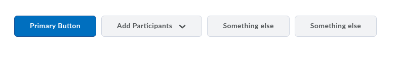
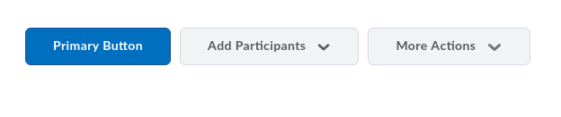
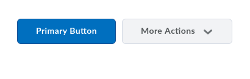
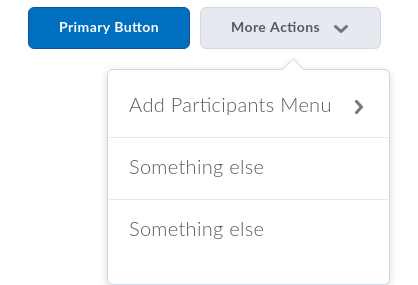

# d2l-button-group
[![Bower version][bower-image]][bower-url]
[![Build status][ci-image]][ci-url]

A collapsible button group component

For further information on this and other D2L UI components, see the docs at [ui.valence.d2l.com](http://ui.valence.d2l.com/).

## Installation

`d2l-button-group` can be installed from [Bower][bower-url]:
```shell
bower install d2l-button-group
```

## Usage

```html
<head>
	<script src="https://s.brightspace.com/lib/webcomponentsjs/0.7.21/webcomponents.min.js"></script>
	<link rel="import" href="../d2l-button-group/d2l-button-group.html">
	<link rel="import" href="../d2l-button/d2l-button.html">
</head>
```

```html
<d2l-button-group keep="1">
	<template strip-whitespace>
		<button is="d2l-button" primary>Primary Button</button>
		<d2l-dropdown>
			<d2l-dropdown-button text="Add Participants">
				<d2l-dropdown-menu>
					<d2l-menu label="Add Participants Menu">
						<d2l-menu-item text="Add Existing Users"></d2l-menu-item>
						<d2l-menu-item text="Create and enroll a new user"></d2l-menu-item>
						<d2l-menu-item text="Import users from file"></d2l-menu-item>
					</d2l-menu>
				</d2l-dropdown-menu>
			</d2l-dropdown-button>
		</d2l-dropdown>
		<button is="d2l-button">Something else</button>
		<button is="d2l-button">Something else</button>
	</template>
</d2l-button-group>
```

### No "More Actions"



### With "More Actions"




#### Submenu in "More Actions"


## Coding styles

### General

See the [VUI Best Practices & Style Guide](https://github.com/Brightspace/valence-ui-docs/wiki/Best-Practices-&-Style-Guide) for information on VUI naming conventions, plus information about the [EditorConfig](http://editorconfig.org) rules used in this repo.

[bower-url]: http://bower.io/search/?q=d2l-button-group
[bower-image]: https://img.shields.io/bower/v/d2l-button-group.svg
[ci-url]: https://travis-ci.org/BrightspaceUI/button-group
[ci-image]: https://travis-ci.org/BrightspaceUI/button-group.svg?branch=master
