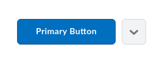
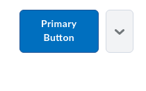

# d2l-button-group
[](https://www.webcomponents.org/element/BrightspaceUI/button-group)
[![Bower version][bower-image]][bower-url]
[![Build status][ci-image]][ci-url]

[Polymer](https://www.polymer-project.org)-based web component to responsively encapsulate a group of buttons and drowdowns.

For further information on this and other Brightspace UI components, see the docs at [ui.developers.brightspace.com](http://ui.developers.brightspace.com).

## Installation

`d2l-button-group` can be installed from [Bower][bower-url]:
```shell
bower install d2l-button-group
```

## Usage

### No "More Actions"


### With "More Actions"


#### Submenu in "More Actions"


### Compressed




## Developing, Testing and Contributing

After cloning the repo, run `npm install` to install dependencies.

If you don't have it already, install the [Polymer CLI](https://www.polymer-project.org/2.0/docs/tools/polymer-cli) globally:

```shell
npm install -g polymer-cli
```

To start a [local web server](https://www.polymer-project.org/2.0/docs/tools/polymer-cli-commands#serve) that hosts the demo page and tests:

```shell
polymer serve
```

To lint ([eslint](http://eslint.org/) and [Polymer lint](https://www.polymer-project.org/2.0/docs/tools/polymer-cli-commands#lint)):

```shell
npm run lint
```

To run unit tests locally using [Polymer test](https://www.polymer-project.org/2.0/docs/tools/polymer-cli-commands#tests):

```shell
polymer test --skip-plugin sauce
```

To lint AND run local unit tests:

```shell
npm test
```

[bower-url]: http://bower.io/search/?q=d2l-button-group
[bower-image]: https://badge.fury.io/bo/d2l-button-group.svg
[ci-url]: https://travis-ci.org/BrightspaceUI/button-group
[ci-image]: https://travis-ci.org/BrightspaceUI/button-group.svg?branch=master
